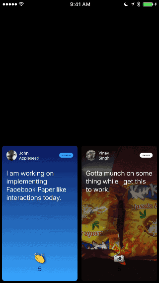

# rn-paper-interface

Implementation of Facebook Paper-like interactive UI in React Native.

Read the blog post: [Building a Facebook Paper-like UI with React Native](https://medium.com/@paramaggarwal/building-a-facebook-paper-like-ui-with-react-native-4a753623d343#.1ou5i5ntm) on Medium.

This is a technical demo and not a library. Feel free to learn from the code and adapt to your use-case.

# Demo

Run with Exponent: [https://getexponent.com/@community/paper-interface-example](https://getexponent.com/@community/paper-interface-example)

See it on Vimeo: [https://vimeo.com/175727390](https://vimeo.com/175727390)

# GIF

# Try it out

1. Clone the repo
2. Run `npm install` and `rnpm link`.
3. Open `ios/RNPaperInterface.xcodeproj` and run the project.
4. This should compile the project and run the sample in the simulator.

# Author
Param Aggarwal (paramaggarwal@gmail.com)

# License
MIT License
